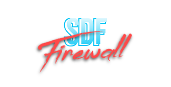
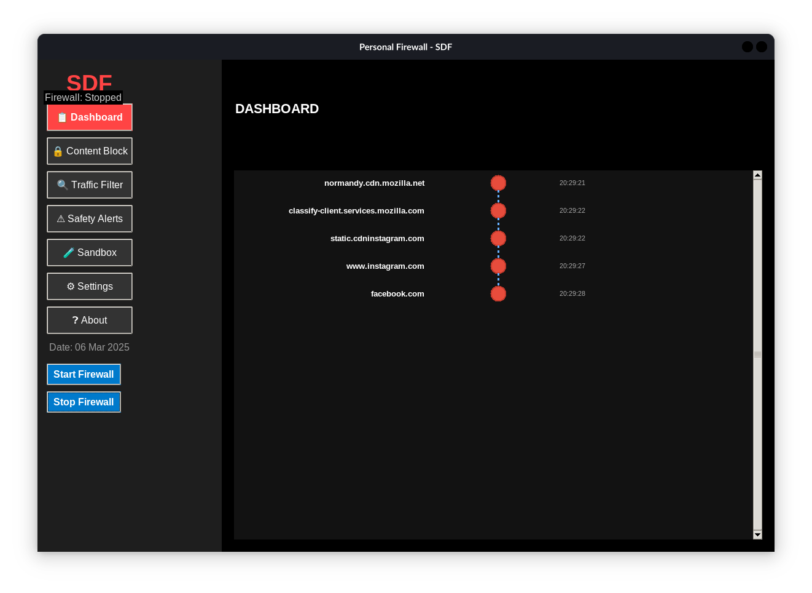
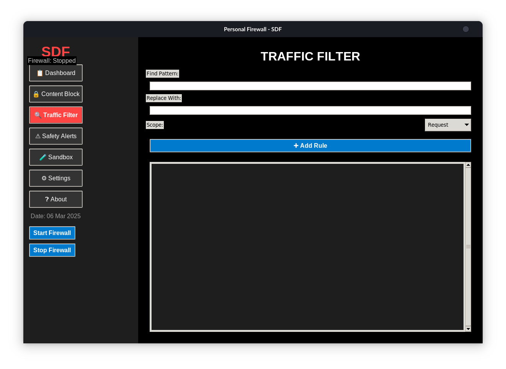

<div align="center">
<h1> 🔥 Codx Firewall <br> Enterprise-Grade Personal Firewall Solution</h1>
</div>

<div align="center">
    
    <p><em>Advanced Security for Modern Web Browsing</em></p>
</div>

## 🚀 Overview

**Codx Firewall** is an enterprise-grade personal firewall engineered to provide high-grade protection for your web activities. Leveraging advanced threat detection algorithms and real-time monitoring, it creates an impenetrable shield against modern cyber threats.

### 🎯 Key Highlights

- 🛡️ **Enterprise-Level Security**
- 🌐 **Cross-Platform Compatibility**
- ⚡ **Lightweight & Resource-Efficient**
- 🔄 **Real-Time Protection**

## 💫 Core Features

### Security Components

- 🔍 **Intelligent Traffic Analysis Engine**
- 🚫 **AI-Powered Content Filtering**
- 🕵️ **Advanced Threat Detection**
- 📊 **Real-Time Analytics Dashboard**

### Management Features

- ⚙️ **Granular Control Settings**
- 📜 **Detailed Activity Logging**
- 🎮 **User-Friendly Interface**
- 🔐 **Security Policy Management**

<div align="center">
    
    
</div>

## 🛠️ Quick Setup

### Windows Installation

```powershell
git clone https://github.com/sd-shiivam/codx.git
cd codx
python -m venv firewallEnv
.\firewallEnv\Scripts\activate
pip install -r requirements.txt
python Main.py
```

### Linux Installation

```bash
git clone https://github.com/sd-shiivam/codx.git
cd codx
python3 -m venv firewallEnv
source firewallEnv/bin/activate
pip install -r requirements.txt
python Main.py
```

## 🎯 Usage Guide

1. 🚀 **Launch Application**: Start the firewall service
2. 🔍 **Configure Settings**: Set up protection parameters
3. 📊 **Monitor Activity**: Track through the dashboard
4. 🛡️ **Enable Protection**: Activate security features
5. ⚙️ **Fine-tune Rules**: Customize security policies

## 🗺️ Roadmap

- 🔄 Persistent Configuration System
- 🌐 Multi-Platform Support Enhancement
- 📊 Advanced Analytics Integration
- 🤖 Machine Learning-Based Threat Detection

## 🤝 Community

- 📢 [Report Issues](https://github.com/sd-shiivam/codx/issues)
- 💡 [Feature Requests](https://github.com/sd-shiivam/codx/pulls)
- 🌟 [Star us on GitHub](https://github.com/sd-shiivam/codx)

## 📜 License

Released under [MIT License](LICENSE)

---

<div align="center">
    <strong>Enter in Your Digital world with Codx Firewall Controls</strong>
</div>
